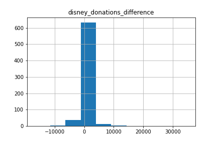

```{r setup, include=FALSE}
knitr::opts_chunk$set(echo = FALSE)
# Load dependencies 
library(reticulate,) # For rendering Python code 
```

## Abstract

The undue influence of political donations on parliamentary
voting behavior is well-researched, well-known, and a
truism of public perception of American politics. However
the reverse – the effect of voting behavior on the direction of
campaign funds by major corporate donors – does not appear
in prevailing literature. While the idea that legislators
are beholden to their donors interests is colloquial, current
research fails to investigate the mechanisms through which
donors respond to votes. Therefore, the following project
aims to build a model that can predict changes in the level
of campaign donations to legislators in the US House of
Representatives as a function of their voting behavior in the
previous legislative session. The project applies causal forest
models to recover the effect of party line voting. The
model aims to test the theory that donors invest in political
campaigns primarily out of expectations of legislators
following party positions. Deviations from this expectation
- voting against the party line - is therefore expected to be
penalized by donors. In order to help elucidate how machine
learning techniques can be employed in causal inference
settings, we will highlight the limitations standing in
the way of recovering causal effects in the relationship in
question and how recent developments in machine learning
methods of causal questions can be implemented in observational
settings.[^1]


## Introduction


In the wake of the landmark 2010 US Supreme Court decision Citizens
United vs. the US Federal Election Commission, the influence of
corporate money in US politics has risen impressively. In parallel with
a tidal wave of money washing over the electoral process is the rising
tide of social science literature aiming to capture the effect of money
on the voting behavior of legislators. Building off of decades of
research into the determinants of congressional voting, recent
literature has employed state of the art ML methods to attain
predictions with considerable success.

Authors have been able to accurately predict past voting behavior
[@smith2012predicting] and future behavior of non-incumbents
[@bonica2018inferring] using campaign donation history and supervised
learning methods. These publications have resulted in more accurate
predictions of voting behavior than previous statistical methods,
specifically those that draw from spacial models inferring ideological
positions of legislators from past voting behavior
[@clinton2004statistical][@poolehoward]. This has been particularly
helpful in providing predictions for non-incumbents without a voting
history.

In a study published by Adam Bonica in 2018, random forest and
support-vector regressions were used to map predictions of
non-incumbents on inferred ideological positions from prevailing spatial
models through campaign donations [@bonica2018inferring]. While the
models provided vote predictions for this cohort (non-incumbents) just
as or more accurate than roll call predictions of legislators with a
voting record, he writes, \"I exclude corporate and trade PACs from the
feature set due to their tendency to mix ideological and strategic
motives.\" The success of ML methods in using campaign donation data
indicates that political contributions are a powerful predictor voting
behavior, however the prevailing literature neglects to address the
potential of reverse causality: that voting behavior can have an affect
of the direction of campaign contributions. We therefore aim to shed
light on this comment made by Bonica, namely the potential ideological
or strategic motives of major campaign contributors and how they respond
to congressional voting behavior.

Despite a paucity of scientific literature on this issue, current
journalistic coverage of US politics demonstrates how common knowledge
it is that donors actively respond to legislative outcomes. In February
of 2021, Thompson Reuters reports, \"Ten U.S. corporations slashed
donations to candidates seeking federal office by more than 90 per cent
in January, after pledging to cut off giving to the Republicans who
supported former President Donald Trump's attempt to overturn his
election defeat.\" [@reuters2021] Additionally, as a result of
anti-easy-voting laws in Georgia, many corporate donors have publicly
chided legislative officials and threatened to pull donations from key
legislators. [@CNBC2021]

Whether threatening lawmakers that supported a ham-handed coup in 2021
or those that too aggressively seek to regulate certain industries,
donors are responsive actors in the US political system. Implicit in
studies on the voting outcomes as function of political contributions is
that legislators are somewhat beholden to their donor's interests.
Logically, the threat of reducing or canceling contributions must be
credible, otherwise legislators would not be incentivised to follow
donor interests. And if donors were totally unresponsive to 'disloyal
votes' by legislators, research examining the influence of money in
parliamentary bodies might itself be moot. We therefore believe that to
capture a full picture of corporate money in the electoral process,
further literature must reverse its typical methodologies and situate
the donor at the center of analysis.

To describe the potential relationship more concretely, legislators may
signal to untapped donors their position on new issues, or break with
existing donors on important pieces of legislation, running afoul of
their contributor's interests. Such action would theoretically have an
effect on how donors choose to funnel campaign funds in the future, and
over time may lead to substantial shifts in corporate giving as parties
stake out new positions over time. As the US party system has
experienced a seismic shift over the last 10 years in relation to
positions on health care, taxation, finance, and resource extraction,
the potential to observe shifts it corporate giving is strong.

Drawing on data of corporate donations to individual candidates
(including from the organization itself, family of owners/leading
representatives, and associated PACs, or, Political Action Committees),
we reverse the focus of prevailing literature to examine how corporate
donors respond to voting behavior in the US House of Representatives.
Recovering corporate donation strategies and further shedding light the
risk-reward structure that legislators navigate a central motivation of
this project.

To identify any potential relationship between our independent variable
of interest and the resultant change in campaign contributions in
response to those votes, we follow a causal identification approach.
Casual inference goes beyond transitional statistical or machine
learning methods by positing and defending a set of logical assumptions
that can affect the design of the model and, if the assumptions are
defended credibly, allows the researcher to make causal claims about the
relationship in question. Congress members may face tough choices
between the opinion of their district, party, or conscience and the
needs of their donors, and if they choose to respond to pressures from
one stakeholder other than their donor, we believe these votes may cause
reduced or canceled funds in subsequent cycles.

Using available data on political contributions made by donor
organizations to individual House Members from 2012 to 2018, this
project analyzes the effect roll call votes grouped by legislative topic
and coded as a percentage of votes followed the party line. These
party-line vote ratios are averaged into a single percentage of party
voting in that year. We theorize that donors are likely to donate to
members based on their party's position on major topics that affect
their businesses, and that the probability of following the party line
on a given topic is a major signal to donors that will be either
rewarded or penalized depending on the legislator's party and the donor
in question. Although parties are not completely homogeneous, the rate
of party-line votes has been steadily increasing over the last decades,
which reasonably indicates that donors may expect parties to deliver
more consistent support on various legislative topics.

{width="75%"}

This also means that breaking with party lines could potentially be a
stronger treatment, as is it much less common. The outcome of the model
is the difference in donations from one year to the next for a specific
legislator and specific donor, with the preceding years' party line vote
metric used as the treatment. Our model includes additional covariates
that may moderate outcomes. These covariates are where we theoretically
would be able to interpret donor strategies from the model. For
instance, we include party identification, which would allow us to
interpret the donor's behavior toward each party and we include year
dummies to indicate shifts in donor strategies over time. After running
our models, we were confronted with major deficiencies in our data
collection process that prevents us from making substantial
interpretations of our results. Above all, a lack of variability in our
outcome variable - the change in donations from one year to the next -
severely limited the number of observations in which treatment effects
could be observed. Donors proved to be somewhat stable in their
donations, and as a result our model outcomes had extremely high
confidence intervals. Despite having no meaningful results to interpret,
the following project demonstrates how Casual Forest methods can be
implemented and how they differ from random forest estimation.

## Related Work


The integration of machine learning and causal inference has led to a
recent boom within the field of econometrics. As our task seeks to
discover potential donor strategies that differ based on metrics such as
party affiliation and the specific election cycle, we draw from
literature investigating heterogeneous treatment effects within
observational data. The relevant literature sketching out possible
methodologies has been primarily published within the last 5 years, and
as such provides overview of a growing field and the associated ML tools
created for such models.

Athey and Imbens 2016 study, \"Recursive partitioning for heterogeneous
causal effects,\" serves as a starting point for the balloon in
literature on adapting random forest algorithms for causal questions
[@athey2016recursive]. The authors demonstrated how random forest
algorithms can be modified to optimise a treatment effect of subgroups
rather than optimise the prediction of an outcome. They demonstrate that
these causal effects can be recovered in both trial and observational
studies. The main contribution of this study is that using their
adjusted methodologies can produce confidence intervals for subgroups
through the partitioning of the tree in one sample and the estimation of
treatment affects using another. This methodology is called the
\"honest\" approach and will be implemented in our models.

Davis and Heller (2017) apply a similar algorithm to identify
heterogeneous treatment effects of youth employment programs on
violent-crime arrests and employment. Using data from randomized
controlled trials of a summer jobs program, they find that the applied
method is able to identify treatment heterogeneity that a conventional
model with interactions effects would have missed. However, running a
in-sample, out-of-sample and an adjusted-in-sample model, the authors
conclude that the success of out-of-sample models is quite sensitive to
the sample size, and causal forests might be better suited for setting
with more observations [@davis2017using].

Wager and Athey (2018) further assessed the properties of causal forests
algorithms within a quasi-observational setting. They use a dataset
modeled after the National Study of Learning Mindsets, which evaluated
the impact of a mindset intervention (instilling a "growth mindset") on
students scholastic achievements, to examine practical and conceptual
challenges of causal forests. They find that especially clustered data
(at the school level) needs to be considered in casual forest approaches
and may lead to substanial bias if not controlled for. They present a
set controls that can be implemented in causal forest estimation
packages within R [@wager2018estimation]. A year later, Athey again
expanded use case of causal forest algorithms to including IV based
approaches and conditional average partial effects estimated within
observational and experimental settings.

In April of 2021, David Jacob published a study entitled, \"CATE meets
ML,\" which provides a comprehensive overview to various ML techniques
that can recover heterogeneous treatment effects, or CATEs (conditional
average treatment effects) [@danieljacob2021]. Together, these papers
helped us to understand how these novel methods work and how they can be
applied to our causal question: Do donors reward or sanction legislators
for voting for or against party lines?

## Proposed Method


The collection of our data and construction of our model was guided by a
causal approach, specifically using the potential outcomes framework
(POF). The POF is a convenient way of demonstrating the fundamental
problem of causal inference. In order to be able makes claims on
causality, rather than simply correlation, we need to know two things,
the outcome for an observation in the control state and the outcome for
that very same observation in the treatment state.
$${Treatment Effect = \mathbb{E}[Y(1) - Y(0)]},$$ In the real world,
however, only one state can be observed. Either a patient receives a
vaccine in a clinical trial or a placebo - but not both. Without being
able to observe both states of the world for the same observation, we
must compare treatment and control groups who are necessarily different
from one another in many ways. Fundamentally, the difficulty of causal
inference is either removing methodologically any factor that may
influence your outcome other than the treatment or assume away potential
confounders. If the resultant methodology and set of assumptions are
convincing, causal effects may be recoverable. In randomized controlled
trials, this is much easier to manage, however in observational settings
where many confounding variables are unobservable, recovering causal
effects is a tall order.

In order to derive a causal estimation of the effect of party line
voting, we began this project by conceptualizing the causal pathways of
the relationship we were hoping to measure. Our data captures the
treatment as a percentage of votes along party lines for the individual
legislator and our outcome as the change in donations from the previous
cycle. We collected these data points over 4 time periods, allowing us
to potentially remove considerable bias out of the model.

{width="75%"}

The graph in Figure(2) is what is called a Directed Acyclic Graph (DAG),
which visually represents how variables in our model may be related.

Drawing from seminal work by Imai and Kim (2019), we initially tried to
create a model that would satisfy the following four assumptions
necessary to estimate causal inference within panel data.
[@imai2019should].

1.  **No unobserved time and unit varying confounder:** In figure two,
    we can see the unobserved confounders at the unit and time level
    drop out of the model (highlighted in gray) due to the panel data
    structure. Having multiple units in single time periods and multiple
    time periods for single units controls for many potential
    confounders local to the unit or time period. More problematic for
    our model would confounders that vary at the *unit and time level*
    and might affect donations in the subsequent cycle. This could be
    changes in committee assignments of a legislator into topics
    relevant to the donor's business or gaining a position in the party
    leadership.

2.  **Past outcomes do not influence current ones:** The only way that
    this would effect our model is if legislators did not spend all of
    their money from their campaign and carry it over to the next. While
    this is often true, our data is not taken from the legislator, but
    rather from the donor, meaning that it includes only the funds
    disbursed each year.

3.  **Past outcomes do not affect current treatment:** This is the most
    difficult assumption to hold within our data structure, and
    generally requires the use of an instrumental variable that can
    reasonably predict the treatment and has an affect on the outcome
    exclusively through that treatment. Unfortunately without an IV that
    can predict our party-line vote metric while remaining otherwise
    independent from the outcome, we could not have made exclusive
    claims on causal effect. Practically, there will always be a chance
    that the party-line percentages are determined by donations in the
    previous year, rather than the other way around.

4.  **Past treatments do not affect current outcomes:** While past
    treatments do influence future outcomes (and is in fact the main
    effect we want to measure), we would only have to compensate by
    measuring the effect of 2012 party line votes as a predictor of 2014
    donations. This is already incorporated into the the DAG and into
    the data structure.

While the model structure in the DAG proves sound for traditional
statistical methods, we ran into severe limitations of our software in
working with panel data, and as a result were forced to alter our model
strategy from looking at individual treatment effects (at the level of
the legislator) to conditional treatments effects, which are
'conditioned' by some moderating variable that splits the observations
into subgroups.

To do this, we implemented the CausalForestDML method within the EconML
package developed by Microsoft Research. It is the first software
package in Python that provides a framework for estimating heterogeneous
treatment effects (also knows as conditional average treatment effects)
for observational data. Models within the package are geared toward
providing subgroup treatment effect estimates, which meant that our goal
of understanding donor behavior in relation to certain groups, for
instance Democrats or Republicans, could be achieved.

For our model, we chose to implement a Causal Forest Regression, which
has two major differences to random forest models. Firstly, while a
typical regression tree splits the data on a variable and value that
reduces a measure of uncertainty (i.e. MSE), a causal tree will make a
split on a variable and a value that maximizes the difference in the
outcome across the treatment and control conditions within a leaf. While
a random forest makes prediction, the causal forest calculates the
treatment effect for a subgroup at each split. The second major
difference regards how the data is split. An \"honest\" causal tree will
split the data into two groups, a splitting sample and an estimating
sample. The process above, of calculating treatments effects, will be
done within the splitting sample until the tree has been constructed.
This tree is then applied to the estimating subsample, which lets the
observations drop down the tree until they reach a terminal node. Once
the data is in place, the CausalForestDML method will implement an
estimation function to recover treatment effects within each leaf. The
result is an \"honest\" causal forest, where the resultant point
estimates are normally distributed.

In terms of our potential outcomes framework, our model no longer
attempts to recover individual average treatment effects, but rather
conditional average treatment effects (CATE). The \"conditional' element
is subgroup in which treatment effects are calculated. The estimate can
be defined as: $${\tau (x) = \mathbb{E}[Y(1) - Y(0)| X = x]},$$ Where
$X$ could be any moderator of the treatment variable, such as gender,
party affiliation, or ethnicity. To implement this model within our
data, we followed case examples provided by the github repository for
the EconML package [@GithubEconML] and from [@towardsDS]. In order to
assist in interpreting our models, we additionally implemented the SHAP
(SHapley Additive exPlanations) package in Python uncover potential
drivers of our treatment effects.

## Experiments

#### Data:

Our analysis relies on data coming from three different sources. First,
we include data on all Members of the House of Representatives (MoHs)
who served in all sessions along our timeline, which encompasses the
113th to the 116th Congress. It total this is 224 house members. We made
this decision to restrict our observations when we were following a
panel data estimation strategy. To get complete lists of all people who
served in the respective sessions in the observed time frame, we are
using the comprehensive data sets of the Comparative Legislators
Database provided by Munzert and Göbel [@gobel2020comparative], which we
adjusted for our needs (\"01\_Creating\_MoH\_Dataset.ipynb\"). In
addition to a complete list of MoH's names, we use the database
primarily for information regarding the gender, race and party
affiliation of MoHs, which are examined regarding their predictive power
as features in Random Forest Models and serve as moderators in the
Causal Forest Models.

Second, we include data on roll call votes taken from GovTrack.us
[@GovTrack] that contains the individual votes of all Members of the
House (MoHs). The bills that are subject of roll call votes are sorted
into categories which allows us to examine in a more targeted manner in
which area individual voting behavior by MoHs has an effect on donor
behavior. For our main independent variable we aggregated the results of
all roll call votes in several categories (given by GovTrack) that were
chosen based on the business model of the respective donors examined in
our analysis. Based on the roll call votes in each category a variable
is created that indicates the ratio of votes along the party line for
the individual legislator. The party line is defined as the vote of the
majority of MoHs of the same party on the respective bill
(\"02\_Cleaning\_Vote\_Data.ipynb). By having the ratio of votes along
the party line for each MoH in several different categories, we are able
to to analyze in which areas donors respond to individual votes and in
which areas diverging voting behavior has little impact on future
donations. As we are looking at party lines, our analysis does not
include votes by independent candidates.

Third, the donation data is taken from OpenSecrets.org which is run by
the Center for Responsive Politics [@opensecrets]. It categorizes
donations per election cycle, meaning that donations for 2012 will be to
candidates serving in the congressional session beginning in 2013. This
structure of the data is why we will be lagging out the predictor
variable, so that the voting percentages in session beginning 2013 will
be used to predict values for donations in the 2014 election cycle and
so on. For our dependent variable we are taking the change in donations
from a certain donor to an individual MoH between two sessions.
(03\_Merge\_Donations\_MoH(Walt).ipynb).

In all, there are 30 categories of legislation avaialable on GovTrack,
however we were unable to automate the scraping of the data and as a
result were only able to include 5 legislative categories in our data
set. As will be discussed in subsequent section, the lack of data meant
that we could not reliably run tests to determine whether donors were
specific to a subset of a broad range of categories, nor could we know
whether the party line vote metrics for the 5 categories (mostly
financial related.) are not systematically different from overall voting
behavior. Similarly, we were not able to automate the data collection
process for the donor data either. As a result we only have data for two
donors, and neither of them exhibit high variability in our outcome
variable.

Our two donors are Walt Disney Inc. and Bloomberg LP, and our categories
are Commodities Markets, Financial Crisis Stabilization, Insurance
Industry and Regulation, Real Estate Business and Television and Film.
Both donors are plausibly related to at least two of these categories,
and without automating the data scraping process we could not expand our
data any further.

#### Software:

We ran our models on Python 3.8.5, and used JupyterLab 2.2.6 as
interface to write code and conduct our analyses. Moreover, we used
GitHub to collaborate on the project and for version control. EconML and
SHAP were used to run the main causal models and provide interpretable
output.

#### Random Forest:

In order to better investigate the relationship between the voting
behaviour of MoHs in certain legislative categories and changes in
donation patterns, we ran several basic Random Forest Models as initial
step of data exploration. First, we examine patterns in the voting
behaviour of Walt Disney based on the legislative category \"Television
and Film\", and the four other categories that can be attributed to the
financial sector (07\_Random\_Forest\_Disney.ipynb). With the outcome
variable encoded into a discrete categorical variable that takes on 0 in
case of an decrease of donation, 1 in case of no change in donation and
2 in case of an increase in donation between two years, we run a
RandomForestClassifier that yields an accuracy of 0.6697 in a baseline
model with n\_estimators = 1000 and max\_leaf\_nodes = 10. The accuracy
can be increased up to 0.7030 by running another model with tuned
hyperparameters using RandomizedSearchCV [@chen2021introduction] with
n\_iter = 100, cv = 3.

A RandomForestRegressor that takes the outcome as a discrete variable in
absolute terms, i.e. changes in donations by Walt Disney between two
years, returns a RMSE of 2763.61 in a baseline model with n\_estimators
= 500. Again by using RandomizedSearchCV with n\_iter = 100, cv = 3, the
RMSE can be brought down to 1472.34 for the Walt Disney donation data
(MAE and MSE show a comparable reduction in error).

Figure(3) exemplifies the grid search cross-validation process on a
two-dimensional level by visualizing potential combinations of
max\_depth and max\_features (in this example via GridSearchCV instead
of RandomizedSearchCV).

![Random Forest Regressor cross-validation via GridSearchCV
[@CodeGridSearch], CV score = - 0.049983, at max\_depth = 1 and
max\_features =
3](DisneyRFRegressor_ GridSearchCV_hyperparameters.png){width="75%"}

Figure(4) illustrates the importance of all features used in the Random
Forest Regression Model trained on the Walt Disney donation data. The
underlying values are based on the best random model determined by
RandomizedSearchCV.

![Feature importance for Walt Disney donation data based on best random
model via RandomizedSearchCV [@chen2021introduction] (with n\_iter =
100, cv =
3)](Disney_Regression_bestrandom_sorted_feature_importances_doughnut.png){width="75%"}

As expected, the variable encoding the ratio of voting along parties
lines in the category \"Television and Film\" proves to be most
important (21.22%) for predicting changes in Walt Disney's donation
behaviour. Voting along party lines in the other four examined
categories, however, also entail high predictive power with values
ranging from 6.98% up to 16.30%. Unsurprisingly, both party indicators
prove to be more important than other MoH-specific characteristics as
gender or ethnicity. However, all MoH characteristics are significantly
less important compared to most of the legislative categories. Moreover,
there are noticeable differences between the indicators for different
years that are included in the model, with the relevance of a certain
voting behaviour in 2016 being almost twice as important as in 2012.

Secondly, we examine whether a similar clear relationship between
Bloomberg LP's donation patterns and the voting behaviour of MoH in
legislative categories associated with the financial sector prevails
(07\_Random\_Forest\_Bloomberg.ipynb). Again encoding the outcome as a
discrete categorical variable, a baseline RandomForestClassifier with
n\_estimators = 1000 and max\_leaf\_nodes = 10 yields an accuracy of
0.9598 which is notable higher compared to the results for Walt Disney.
Running a second model with tuned hyperparameters using
RandomizedSearchCV with n\_iter = 100, cv = 3 does not further increase
accuracy.

![Feature importance for Bloomberg LP donation data based on best random
model via RandomizedSearchCV [@chen2021introduction] (with n\_iter =
100, cv =
3)](Bloomberg_Regression_bestrandom_sorted_feature_importances_doughnut.png){width="75%"}

Figure(5) illustrates the importance of all features used in the Random
Forest Regression Model trained on the Bloomberg LP donation data. The
underlying values are based on the best random model determined by
RandomizedSearchCV.

Again, the ratios of voting along party line in different legislative
categories prove to be the most important features regarding the
prediction of changes in Bloomberg's donation patterns.

#### Causal Forest:

The previous models indicated that party line voting was at least a
reasonable predictor of the data we had. With this in mind, we moved
forward to our causal models to recover treatment effects along the
categorical variables we had in the data.

As the analysis of features importance for both Disney's and Bloomberg's
donation data has shown, legislative categories that are related to the
respective business segment have a higher predictive power compared to
other categories and compared to MoH-level characteristics. As we had
decided to code our treatment variable as a average of party line vote
percentages across the topics we had within the data, the results from
the Random Forest models dampened our expectations of the CATE
estimations as they would be driven by categorical features with low
predictive power.

In running the causal models, we shift from estimating model accuracy to
estimating conditional treatment effects of a single party-line vote
ratio. Using CausalForestDML, we implemented an 'honest' causal forest
model with covariate dummies for year, ethnicity, gender and party, and
the outcome variable as the difference in donations between years. We
chose a MultiTaskLassoCV estimator for both fitting the outcome
(model\_y) and the treatment to the features (model\_t) as both our
treatment and our outcome variables are continuous [@econml.lasso].

{width="75%"}

As Figure(6) illustrates, the confidence intervals of the conditional
average treatment effects on changes in Bloomberg's donation patterns
vary widely, with a large section in the middle hugging no effect. This
is primarily due to the sheer lack of variability in the outcome
variable. This also potentially explains why the Bloomberg Random Forest
model was able to predict so well: a vast majority of the observations
showed no change, with only a few outliers.

{width="75%"}

Figure(7) displays the SHAP values, i.e. the impact of covariates on the
outcome variable, based on Bloomberg donation data. To be precise, the
figure illustrates three things: First, feature importance is ranked in
descending order, meaning that \"Year\_2014\" is the top feature in the
model. The color indicates high or low values of that feature and the
direction indicates whether the values contributed positively or
negatively to the outcome. For example, the covariate
\"party\_short\_D\" is a dummy variable that takes on values 0, i.e. a
low feature value (blue), and 1, i.e. a high feature value (red).
Looking at the SHAP value, we can see that red points, i.e. being a
member of the Democratic party, have an positive impact on the models
output, i.e. a positive change in donation money from Bloomberg, while
blue points, i.e. not being a member of the Democratic party, have an
negative impact on the outcome variable. This aligns with the fact that
Bloomberg LP is a highly partisan donor that mostly gives to
Democrats.[^2]

{width="75%"}

We additionally ran a causal forest model on the Disney donation data.
Figure(8) displays the respective confidence intervals around the CATEs.
As we can see the confidence intervals do vary less over the number of
observations but do include zero at all times. This is likely a result
of greater outcome variability within the Walt Disney data. Figure(9)
shows us the SHAP values for the features for the causal Disney model.

{width="75%"}

## Analysis

The unfortunate reality is that the data the models is so sparse that
any attempt to recover heterogeneous effects is impossible. Moreover,
the interpretation of certain results are meaningless given that
outcomes are likely to be generated by randomness in the data than any
real causal relationship.

Firstly, while our initial experiment in testing the feature importances
of legislative categories against specific donors was supposed to
indicate whether we had matched a donor to the categories that we were
able to manually scrape, it is extremely likely that any category could
simply increase the prediction of the random forest model by chance
rather than any association. For instance, the Bloomberg donation
outcomes were strongly predicted by the voting metric in the Film and
Television category. This could have been by chance or because the
legislator had similar voting habits across all categories - in effect
they either a consistent partisan or non-partisan donor. Without all the
legislative categories, it was our choice then to simply average the
party-line vote percentages into one single treatment variable.

Perhaps the most problematic of our data was the lack of variation in
the outcome. Our outcome variable was only non-zero for roughly 10 per
cent of our data in the Disney data set, and even less for Bloomberg.
The result is that our model is driven by variability in only a few
observations. The data bottlenecks we encountered in scraping the data
unfortunately prevented and solid basis from which to run the models,
and as such our results are somewhat meaningless.

{width="75%"}

Additionally, for what observations that did have changes in the
outcome, we did not have solid covariates to run against them. For
instance, there are many use case examples of EconML that have only 100
to 200 observations, however have a large number of covariates to run
against them - in fact this is what the EconML is particularly suited
for. In that sense, the Disney data could have theoretically provided
enough variability in the outcome for treatment effects to be estimated
given that we additionally had strong covariates. The results from our
Random Forest models indicated that our cateogrial features did not add
significantly to the accuracy of the models and therefore we were not
surprised to see such inaccurate CATE estimates among subgroups.
Examples of additional features we had hoped to include were: relevant
committee assignment, party leadership position, competitiveness of
district, and margin of victory in primary. All of these are potential
observable confounders that we were not able to successfully integrate
within our data sets, and would logically have a larger effect on donor
motivations than either ethnicity or gender. While the year features
could have potentially revealed changes in treatments effects across
important election cycles, we are hesitant to make substantial claims
given the poor quality of the data.

## Conclusions


Because of the lack of data, our study unfortunately has no key findings
to present. While this is extremely disappointing given the interesting
subject matter and the exciting new field of casual ML methods, we have
walked away from the project with a deeper understanding of how ML
methods can be adapted to support causal inference approaches. Moreover,
we are walking away with a solid understanding on how the
CausalForestDML method works and how causal forests differ from random
forest estimation. The primary limitation of our work is, as we have
repeated so often, the fundamental lack of usable data. The EconML
package is specifically designed to handle use cases with not only a
high number of observation but also a high number of covariates. Given
that we are both beginners to machine learning, taking observational
data already collected and cleaned would have given us the space to
delve further into multiple methods within the package and explore model
tuning. Additionally, having a model with solid covariates would have
opened space to delve into model explainability, which is a key
development for the integration of machine learning methods into
questions of causal infernece. Our focus on creating a convincing causal
approach--and collecting and cleaning the data to fit this
approach--reflected our experience with causal inference within
statistical courses. In hindsight, letting go of our focus on finding a
model suitable to panel data would have sent us in a much more
productive direction. Our key lesson from these failures is that more
data provides you more flexibility, and would have prevented us from
running what is actually demonstration of a causal forest project
workflow rather than recovery of casual effects. An avenue for future
work would be to expand our data to include all thirty legislative
categories as coded in our GovTrack source as well as additional
covariates that we have mentioned. Resolving the issue of panel data
within the EconML package is also an avenue for future work. So far as
we know, there is no framework for estimating the treatment effects
within the package that accommodates such a data structure. Pulling data
from many donors and creating legislator level changes in donations
across a specific subset donors could have increased outcome variability
among and allowed us to make generalizations for donor behavior across
the board. With these issues overcome, we might have ended up with the
project we'd hoped for.

## Acknowledgements

Without the many blog posts published in the last few months on the
subject of causal inference and machine learning, we would have been
completely lost. We would additionally like to thank our Slava, Hannah, and Huy for guiding the course.


[^1]: Link to our [GitHub repository](https://github.com/jmitchellb14/donorbehavior)


[^2]: See allocation of [Bloomberg LP's political contributions](https://www.opensecrets.org/orgs/bloomberg-lp/recipients?id=D000031992)
    
